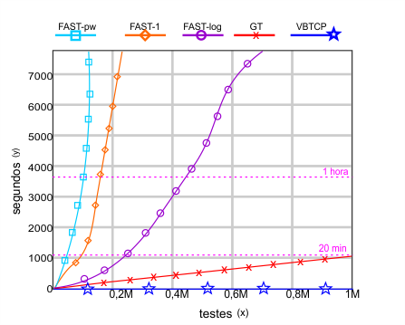

=========================================================================
# Priorização de casos de teste de regressão baseada em valor com Python e Integração Contínua.
### Uma abordagem baseada em múltiplos valores ponderados
=========================================================================

> [!NOTE]
> ## **[MAIQUEL GOMES](https://github.com/maiquelfx)**</br>
> Mestrando no Departamento de Computação </br>
> Universidade Federal Fluminense (UFF) </br>
> Niterói 24210-346, Brasil </br>
> maiquelgomes@id.uff.br </br>

## ABOUT
</br>
Este projeto apresenta uma abordagem inovadora para a priorização de testes, utilizando múltiplos valores ponderados em conjunto com uma emulação inteligente da ordenação do framework pytest. A estratégia envolve ajustes matemáticos que recalibram a ordem de execução dos testes, otimizando permutações com base em scores de prioridade predefinidos.
<p></p>
Integrando princípios matemáticos à computação, nossa metodologia oferece uma análise profunda de fatores como complexidade, risco e prazo. Destaca-se a implementação do uso de dicionários em Python, proporcionando uma abordagem eficiente para a ordenação e execução de testes de regressão.
</br><p></p>
Este algoritmo representa não apenas uma evolução na eficiência do processo de teste, mas também uma contribuição significativa para a melhoria geral da qualidade do software. Impulsiona uma abordagem mais refinada e estratégica na priorização de testes de regressão, destacando-se pela escalabilidade e velocidade proporcionadas pelo uso de dicionários em Python.

## QUESTÕES DE PESQUISA

<table>
<thead>
<tr>
<th width="2000" colspan="2">
</th>
</tr>
</thead>
<tbody>
<tr>
  <td width="80" align="center" valign="top">
    <br>
    </a>
  </td>
  <td valign="top">
    <p>
</br>[Adaptabilidade] - Quão adaptável é a nossa abordagem em diferentes estruturas de testes e/ou Frameworks? 
    </p>
  </td>
</tr>
<tr>
  <td width="80" align="center" valign="top">
    <br>
    </a>
  </td>
  <td valign="top">
    <p>
      </br>[Eficiência] - Como a nossa abordagem se compara a outras técnicas de priorização de casos de teste em relação ao tempo necessário para a priorização?
    </p>
  </td>
</tr>
<tr>
  <td width="80" align="center" valign="top">
    <br>
    </a>
  </td>
  <td>
    <p>
      [Escalabilidade] -  Como um algoritmo pode ser construído a ponto de ser altamente escalável e adequado para diferentes tamanhos de projetos de desenvolvimento de software tanto em termos de testes quanto profundidade de fatores de priorização?
    </p>
  </td>
</tr>
</tbody>
</table>

=========================================================================

## Dependências

- collections
- Python (=>3.6)
- openpyxl (=>3.0.10)
- pandas 
- pytest (=>7.4.2)
- pytest-ordering 
- requests (=>2.26.0)

## Estrutura do projeto
```bash
.
├─ README.md
├─ requirements.txt
├─.github
│   ├── assets
│   │      ├── qp1.png
│   │      ├── qp2.png
│   │      ├── qp3.png
│   │      ├── g3.png
│   │      └── g4.png
│   │
│   └── workflows
│             ├── gerador.yml 
│             ├── pytest.yml
│             └── test_100k.yml
├─ APFD
│   ├── apfd.py
│   └── output.txt
│
├─ MPD
│   ├── test_group_mpd.py
│   └── test_unit_mpd.py
│
├─ Geradores
│   ├──  Gerador_dicio
│   │         ├── gerador_main_timeit.py
│   │         ├── gerador_simple_timeit.py
│   │         ├── gerador_timeit.py
│   │         └── info.txt
│   │
│   ├── gerador1.py
│   ├── gerador2.py
│   ├── gerador3.py
│   ├── gerador4.py
│   ├── gerador_3FP.py
│   ├── gerador_full_3p.py
│   └── gerador_timeit.py
│  
├─ main.py
├─ test_main_unit.py
├─ test_unit_100.py
├─ teste_unit_100k.py
├─ teste_unit_base.py
├─ test_grupos_50k.py
├─ test_main_grupos.py
└──test_main_with_g_30000.py
```
## Instalar dependências
```bash
$ pip install pandas openpyxl~=3.0.10 requests~=2.26.0 pytest~=7.4.2 pytest-ordering
```
> [!IMPORTANT]
>  Nas ponderações, caso seja relativa, é importante que soma dos pesos seja igual a 1
```python
pond_comp = 0.40
pond_prio = 0.60
```
> [!IMPORTANT]
> Nas ponderações, caso seja absoluta, é importante que a soma de `Fi*Pi` seja dividida pela soma de `Pi`
```python
pond_comp = 1
pond_rio = 2
def calc():
  return ((complexidade * pond_comp + risco * pond_prio) / (pond_comp + pond_prio))
```
> [!TIP]
> Equivalência de prioridade relativa
```python
peso_comp = 0.33 #peso1 1/3 -> equivale a peso 1
peso_prio = 0.67 #peso2 2/3 -> equivale a peso 2 // x/3
```
```python
peso_comp = 0.40 #2/5 peso 2 // 0,80/2
peso_prio = 0.60 #3/5  peso 3 'maior prioridade // 1,20/2
```

#### Para desativar um grupo, no bloco da definição dos fatores de prioridade, altera-se o valor da variável declarada `g(n)` para `0`
```python
# grupo 1
complexidade=2
risco=3
dicio['g1'] = calc()
qg1 = 5
g1 = 1 #boolean, 1 para true / 2 para false
```

## Para rodar o Framework via Linux ou WSL
```bash
$ pytest -m test_file.py -v
```
## Para rodar o Pytest via Windows
```python
python -m pytest -v test_unit_100.py
```
```python
python -m pytest -v teste_unit_100k.py
```
```python
python -m pytest -v teste_unit_base.py
```
## Para rodar os testes com grupos
```python
python -m pytest -v test_main_grupos.py
```
## Para rodar os testes unitários de maneira geral
```python
python -m pytest -v test_main_unit.py
```
## Para rodar 100 testes unitários priorizados
```python
python -m pytest -v test_unit_100.py
```
## Para rodar 100.000 testes unitários priorizados
```python
python -m pytest -v teste_unit_100k.py
```
## Gerar arquivo de métrica APFD
```python
python -m pytest -v test_arquivo > output.txt
```
> [!TIP]
> Workflows extensos estão desativados por padrão para evitar sobrecarga de tempo de execução.
> - [x] apfd.yml [2]
> - [ ] gerador.yml [1]
> - [ ] pytest.yml [4]
> - [ ] test_100k.yml [1]

> [!TIP]
> Para o APFD pode ser preciso setar a saída para UTF-8 no CMD
>```bash
>set PYTHONIOENCODING=utf-8
>````

## Resultados (segundos)
| Quantidade de Testes | Tempo de Ordenação (TP) | Testes Priorizados (TP) | Testes Sem Ordenação (TL) |
|----------------------|--------------------------|--------------------------|-----------------------------|
| 10                   | 0                        | 0,39                     | 0,39                        |
| 100                  | 0                        | 0,77                     | 0,74                        |
| 1000                 | 0,000999927520752         | 3,35                     | 2,85                        |
| 10000                | 0,009999752044678         | 3,52                     | 3,3                         |
| 25000                | 0,027008295059204         | 6,32                     | 6,25                        |
| 50000                | 0,078001260757446         | 15,69                    | 17,14                       |
| 100000               | 0,187006711959839         | 29,74                    | 27,23                       |
| 250000               | 0,40993070602417          | 64,27                    | 59,53                       |

##### TP: Testes priorizados / TL: Testes lineares


## Gráfico 2: Comparativo entre o VBTCP e os testes mais citados na literatura
 </a>
 


